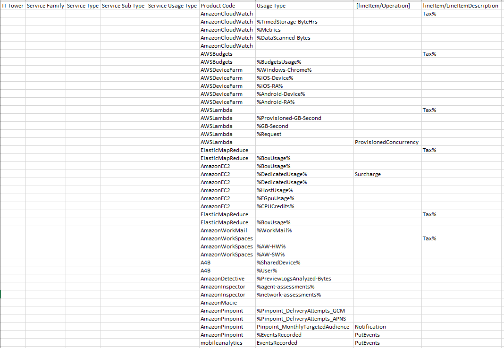

# AWS (lab 1)
___
## Цель работы: 
Знакомство с облачными сервисами. Понимание уровней абстракции над инфраструктурой в облаке. Формирование понимания типов потребления сервисов в сервисной-модели.
___
## Дано: 
1. Слепок данных биллинга от провайдера после небольшой обработки в виде SQL-параметров. Символ % в начале/конце означает, что перед/после него может стоять любой набор символов.
2. Google с документациями провайдера.
___
## Необходимо: 
1. Импортировать файл .csv в Excel или любую другую программу работы с таблицами;
2. Определить соответствие каждого сервиса международного провайдера русскому сервису.
___
## Начальные данные: 

 Проанализировав слепок данных и изучив сервисы Amazon AWS, нашей командой были подобраны аналоги среди сервисов Yandex Cloud. Сервисы этой компании были выбраны по той причине, что компания Yandex является одной из самых крупных и известных в России и обладает наиболее продвинутыми облачными сервисами в России.
 
 Несмотря на то, что компания Amazon является в разы более крупной компанией (согласно отчётам этих компаний, в Yandex работает около 25 тысяч человек, а в Amazon больше полутора миллионов), всем сервисам Amazon AWS удалось найти альтернативы в Yandex Cloud.

| IT Tower                        | Service Type             | Service Usage Type            | Product Code       | Usage Type                     | Yandex.Cloud alternatives             |
|---------------------------------|--------------------------|-------------------------------|--------------------|--------------------------------|---------------------------------------|
| Application services            | Cloud Monitoring         | Tax                           | AmazonCloudWatch   | Tax%                           | Yandex Monitoring                     |
| Application services            | Cloud Monitoring         | TimeStorage                   | AmazonCloudWatch   | %TimedStorage-ByteHrs          | Yandex Monitoring                     |
| Cost Management                 | Budgets                  | Tax                           | AWSBudgets         | Tax%                           | Yandex Cloud Billing                  |
| Application services            | Testing                  | Windows-Chrome                | Amazon Device Farm | %Windows-Chrome%               | Yandex Load Testing                   |
| Compute                         | Lambda                   | Tax                           | AWSLambda          | Tax%                           | Yandex Cloud Functions                |
| Analytics                       | EMR                      | Tax                           | ElasticMapReduce   | Tax%                           | Yandex Data Proc                      |
| Compute                         | EC2                      | Tax                           | AmazonEC2          | Tax%                           | Yandex Instance Groups                |
| Collaboration                   | Mailing                  | WorkMail                      | AmazonWorkMail     | %WorkMail%                     | Yandex Cloud Postbox                  |
| End User Computing              | DaaS                     | AW-HW                         | AmazonWorkSpaces   | %AW-HW%                        | Yandex Cloud Desktop                  |
| AI                              | AI Assistance            | SharedDevice                  | A4B                | %SharedDevice%                 | Yandex Alice                          |
| Security; Identity & Compliance | Threat Detection         | PreviewlogsAnalyzed-Bytes     | AmazonDetective    | %PreviewLogsAnalyzed-Bytes     | Yandex Identity and Access Management |
| Security; Identity & Compliance | Security Assessment      | agent-assessments             | AmazonInspector    | %agent-assessments%            | Yandex Smart Web Security             |
| Security; Identity & Compliance | Data Security            | network-assessments           | AmazonMacie        | %network-assessments%          | Yandex Identity and Access Management |
| Marketing                       | Targeting and statistics | Pinpoint_DeliveryAttempts_GCN | Pinpoint           | %Pinpoint_DeliveryAttempts_GCM | Yandex Cloud Logging                  |

___

### AmazonCloudWatch

Этот сервис предоставляет возможность мониторить различные ресурсы AWS и приложения, которые на них развернуты, а также устанавливать триггеры и инструкции для них (например, отправлять оповещение на почту, если процент использования CPU превысил 90%).

Российский аналог: Yandex Monitoring. Этот сервис позволяет собирать и хранить метрики, а также отображать их в виде графиков на дашбордах.
___

### AWS Budgets

Этот сервис позволяет устанавливать бюджеты на определенные ресурсы AWS и получать уведомления, если они превышены.

Российский аналог: Yandex Cloud Billing. Этот сервис позволяет получать информацию об объеме использованных ресурсов, проверять расходы денежных средств и оплачивать потребление ресурсов.

___

### Amazon Device Farm

Этот сервис позволяет тестировать приложения на реальных устройствах, а также на эмуляторах.

Российский аналог: Yandex Load Testing. Данный сервис позволяет проводить нагрузочное тестирование, чтобы анализировать производительность ваших сервисов и приложений.
___

### AWS Lambda

Этот сервис позволяет запускать код без необходимости управления серверами.

Российский аналог: Yandex Cloud Functions. С помощью Yandex Cloud Functions можно запускать приложения в безопасном, отказоустойчивом и масштабируемом окружении без создания и обслуживания виртуальных машин.

___

### ElasticMapReduce

Этот сервис позволяет обрабатывать и анализировать большие объемы данных, используя платформу Apache Hadoop и другие открытые инструменты.

Российский аналог: Yandex Data Proc. Сервис помогает разворачивать кластеры Apache Hadoop® и Apache Spark™ в инфраструктуре Yandex Cloud. Вы сами определяете размер кластера, мощность узлов и набор сервисов Apache®

___

### AmazonEC2

Этот сервис предоставляет виртуальные машины, которые можно использовать для запуска приложений.

Российский аналог: Yandex Instance Groups. Это компонент сервиса Compute Cloud, который позволяет создавать группы виртуальных машин и управлять ими. Instance Groups автоматически идентифицирует и корректирует неработоспособные виртуальные машины в группе для обеспечения их оптимальной работы.

___

### AmazonWorkMail

Этот сервис предоставляет почтовые ящики для организаций.

Российский аналог: Yandex Cloud Postbox. Сервис отправки транзакционных почтовых сообщений.

___

### AmazonWorkSpaces

Этот сервис предоставляет виртуальные рабочие столы для организаций.

Российский аналог: Yandex Cloud Desktop. Сервис для управления виртуальной инфраструктурой рабочих столов на базе Linux.

___

### Amazon A4B

Этот сервис предоставляет возможность создавать и управлять навыками для устройств с Alexa.

Российский аналог: Yandex Alice. Сервис для создания навыков для устройств с Алисой.

___

### AmazonDetective

Этот сервис предоставляет возможность анализировать данные, которые собираются с различных ресурсов AWS, для обнаружения аномалий и угроз безопасности.

Российский аналог: Yandex Identity and Access Management. Это сервис идентификации и контроля доступа, который помогает централизованно управлять правами доступа пользователей к вашим ресурсам Yandex Cloud. Благодаря IAM все операции над ресурсами выполняются только пользователями с необходимыми правами.

___

### AmazonInspector

Этот сервис предоставляет возможность анализировать ресурсы AWS и приложения, которые на них развернуты, для обнаружения уязвимостей.

Российский аналог: Yandex Smart Web Security. Данный сервис позволяет защитить вашу инфраструктуру от DDoS-атак и ботов на уровне приложений.

___

### AmazonMacie

Этот сервис предоставляет возможность анализировать данные, которые собираются с различных ресурсов AWS, для обнаружения угроз безопасности.

Российский аналог: Yandex Identity and Access Management. Это сервис идентификации и контроля доступа, который помогает централизованно управлять правами доступа пользователей к вашим ресурсам Yandex Cloud. Благодаря IAM все операции над ресурсами выполняются только пользователями с необходимыми правами.

___

### AmazonPinpoint

Этот сервис предоставляет возможность анализировать данные, которые собираются с различных ресурсов AWS, для обнаружения угроз безопасности.

Российский аналог: Yandex Cloud Logging. Сервис позволяет читать и записывать логи сервисов и пользовательских приложений, объединяя сообщения в лог-группы.

