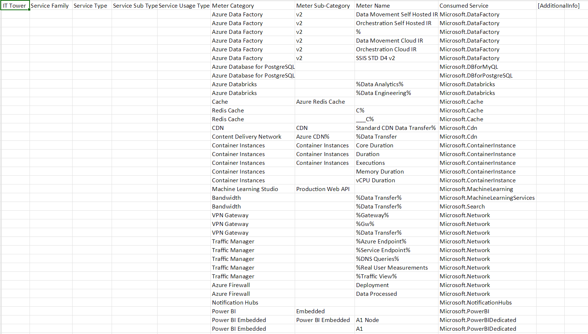

# Azure (lab 2)
___

## Цель работы: 
Знакомство с облачными сервисами. Понимание уровней абстракции над инфраструктурой в облаке. Формирование понимания типов потребления сервисов в сервисной-модели.
___
## Дано: 
1. Слепок данных биллинга от провайдера после небольшой обработки в виде SQL-параметров. Символ % в начале/конце означает, что перед/после него может стоять любой набор символов.
2. Google с документациями провайдера.
___
## Необходимо: 
1. Импортировать файл .csv в Excel или любую другую программу работы с таблицами;
2. Определить соответствие каждого сервиса международного провайдера русскому сервису.
___
## Начальные данные: 

 После анализа слепка данных, и изучив сервисы Microsoft Azure, были подобраны аналоги среди сервисов Yandex Cloud. Были выбраны сервисы Yandex Cloud по той причине, что сама компания Yandex является одной из самых крупных и известных в России и обладает наиболее продвинутыми облачными сервисами в России. 
 
 Конечно, сервисы Microsoft являются разнообразнее и имеют более широкий функционал в отличие от российских аналогов, однако это не помешало подобрать к каждому из исходного списка аналог из Yandex Cloud.

| IT Tower             | Service Type       | Meter Category                | Meter Sub-Category  | Meter Name                   | Consumed Service                  | Yandex.Cloud                          |
|----------------------|--------------------|-------------------------------|---------------------|------------------------------|-----------------------------------|---------------------------------------|
| Application services | Data Integration   | Azure Data Factory            | v2                  | Data Movement Self Hosted IR | Microsoft.DataFactory             | Yandex Data Proc                      |
| Application services | Data Integration   | Azure Data Factory            | v2                  | Orchestration Self Hosted IR | Microsoft.DataFactory             | Yandex Data Proc                      |
| Application services | Data Integration   | Azure Data Factory            | v2                  | %                            | Microsoft.DataFactory             | Yandex Data Proc                      |
| Application services | Data Integration   | Azure Data Factory            | v2                  | Data Movement Cloud IR       | Microsoft.DataFactory             | Yandex Data Proc                      |
| Application services | Data Integration   | Azure Data Factory            | v2                  | Orchestration Cloud IR       | Microsoft.DataFactory             | Yandex Data Proc                      |
| Application services | Data Integration   | Azure Data Factory            | v2                  | SSIS STD D4 v2               | Microsoft.DataFactory             | Yandex Data Proc                      |
| Application services | Data               | Azure Database for PostgreSQL |                     |                              | Microsoft.DBforMyQL               | Yandex Managed Service for MySQL      |
| Application services | Data               | Azure Database for MySQL      |                     |                              | Microsoft.DBforPostgreSQL         | Yandex Managed Service for PostgreSQL |
| Analytics            | Big Data           | Azure Databricks              |                     | %Data Analytics%             | Microsoft.Databricks              | Yandex Data Proc                      |
| Analytics            | Big Data           | Azure Databricks              |                     | %Data Engineering%           | Microsoft.Databricks              | Yandex Data Proc                      |
| Cache                | Cache              | Cache                         | Azure Redis Cache   |                              | Microsoft.Cache                   | Yandex Managed Service for Redis      |
| Cache                | Cache              | Redis Cache                   |                     | C%                           | Microsoft.Cache                   | Yandex Managed Service for Redis      |
| Cache                | Cache              | Redis Cache                   |                     | ___C%                        | Microsoft.Cache                   | Yandex Managed Service for Redis      |
| CDN                  | CDN                | CDN                           | CDN                 | Standard CDN Data Transfer%  | Microsoft.Cdn                     | Yandex Cloud CDN                      |
| CDN                  | CDN                | Content Delivery Network      | Azure CDN%          | %Data Transfer               | Microsoft.Cdn                     | Yandex Cloud CDN                      |
| Compute              | Containers         | Container Instances           | Container Instances | Core Duration                | Microsoft.ContainerInstance       | Yandex Serverless Containers          |
| Compute              | Containers         | Container Instances           | Container Instances | Duration                     | Microsoft.ContainerInstance       | Yandex Serverless Containers          |
| Compute              | Containers         | Container Instances           | Container Instances | Executions                   | Microsoft.ContainerInstance       | Yandex Serverless Containers          |
| Compute              | Containers         | Container Instances           |                     | Memory Duration              | Microsoft.ContainerInstance       | Yandex Serverless Containers          |
| Compute              | Containers         | Container Instances           |                     | vCPU Duration                | Microsoft.ContainerInstance       | Yandex Serverless Containers          |
| Application services | ML                 | Machine Learning Studio       | Production Web API  |                              | Microsoft.MachineLearning         | Yandex DataSphere                     |
| Bandwidth            | Data Transfer      | Bandwidth                     |                     | %Data Transfer%              | Microsoft.MachineLearningServices | Yandex Cloud CDN                      |
| Bandwidth            | Data Transfer      | Bandwidth                     |                     | %Data Transfer%              | Microsoft.Search                  | Yandex Cloud CDN                      |
| Security             | VPN                | VPN Gateway                   |                     | %Gateway%                    | Microsoft.Network                 | Yandex VPC Network Gateway            |
| Security             | VPN                | VPN Gateway                   |                     | %Gw%                         | Microsoft.Network                 | Yandex VPC Network Gateway            |
| Security             | VPN                | VPN Gateway                   |                     | %Data Transfer%              | Microsoft.Network                 | Yandex VPC Network Gateway            |
| Security             | Traffic Management | Traffic Manager               |                     | %Azure Endpoint%             | Microsoft.Network                 | Yandex Load Balancer                  |
| Security             | Traffic Management | Traffic Manager               |                     | %Service Endpoint%           | Microsoft.Network                 | Yandex Load Balancer                  |
| Security             | Traffic Management | Traffic Manager               |                     | %DNS Queries%                | Microsoft.Network                 | Yandex Load Balancer                  |
| Security             | Traffic Management | Traffic Manager               |                     | %Real User Measurements      | Microsoft.Network                 | Yandex Load Balancer                  |
| Security             | Traffic Management | Traffic Manager               |                     | %Traffic View%               | Microsoft.Network                 | Yandex Load Balancer                  |
| Security             | Traffic Analyzing  | Azure Firewall                |                     | Deployment                   | Microsoft.Network                 | Yandex Web Application Firewall       |
| Security             | Traffic Analyzing  | Azure Firewall                |                     | Data Processed               | Microsoft.Network                 | Yandex Web Application Firewall       |
| Application services | Notifications      | Notification Hubs             |                     |                              | Microsoft.NotificationHubs        | Yandex Message Queue                  |
| Application services | BI                 | Power BI                      | Embedded            |                              | Microsoft.PowerBI                 | Yandex DataLens                       |
| Application services | BI                 | Power BI Embedded             | Power BI Embedded   | A1 Node                      | Microsoft.PowerBIDedicated        | Yandex DataLens                       |
| Application services | BI                 | Power BI Embedded             |                     | A1                           | Microsoft.PowerBIDedicated        | Yandex DataLens                       |

___

### Azure Data Factory

Этот сервис предоставляет возможность интегрировать данные из различных источников, а также преобразовывать их и загружать в хранилище данных.

Российский аналог: Yandex Data Proc. Сервис помогает разворачивать кластеры Apache Hadoop® и Apache Spark™ в инфраструктуре Yandex Cloud. Вы сами определяете размер кластера, мощность узлов и набор сервисов Apache®

___

### Azure Database for PostgreSQL

Этот сервис предоставляет возможность создавать и управлять базами данных PostgreSQL.

Российский аналог: Yandex Managed Service for PostgreSQL. Сервис помогает разворачивать и поддерживать кластеры серверов PostgreSQL в инфраструктуре Yandex Cloud.

___

### Azure Database for MySQL

Этот сервис предоставляет возможность создавать и управлять базами данных MySQL.

Российский аналог: Yandex Managed Service for MySQL. Сервис помогает разворачивать и поддерживать кластеры серверов MySQL в инфраструктуре Yandex Cloud. Сервис поддерживает MySQL 5.7 и MySQL 8.0.

___

### Azure Databricks

Этот сервис предоставляет возможность анализировать большие объемы данных, используя платформу Apache Spark.

Российский аналог: Yandex Data Proc. Сервис помогает разворачивать кластеры Apache Hadoop® и Apache Spark™ в инфраструктуре Yandex Cloud. Вы сами определяете размер кластера, мощность узлов и набор сервисов Apache®

___

### Cache

Этот сервис хранящий результаты выполнения запросов за некоторое время, для ускорения выполнения повторяющихся запросов.

Российский аналог: Yandex Managed Service for Redis. Сервис Managed Service for Redis помогает разворачивать и поддерживать кластеры серверов Redis 6.2 и 7.0 в инфраструктуре Yandex Cloud. Redis — это высокопроизводительная СУБД класса NoSQL с открытым исходным кодом, работающая с данными типа «ключ-значение».

___

### Azure CDN

Этот сервис предоставляет возможность ускорять загрузку контента, используя глобальную сеть доставки контента.

Российский аналог: Yandex Cloud CDN. Yandex Cloud CDN позволяет организовать доставку контента до конечных потребителей с помощью сети распространения контента.

___

### Azure Container Instances

Этот сервис предоставляет возможность запускать контейнеры без необходимости управления серверами.

Российский аналог: Yandex Serverless Containers. Сервис позволяет запускать контейнеризированные приложения в безопасном, отказоустойчивом и масштабируемом окружении без создания и обслуживания виртуальных машин.

___

### Azure Machine Learning Studio

Этот сервис предоставляет возможность создавать и управлять моделями машинного обучения.

Российский аналог: Yandex DataSphere. Это сервис для ML-разработки полного цикла, который позволяет использовать все преимущества облачных технологий, сочетая в себе простой и понятный веб-интерфейс, привычные IDE и возможность бесшовного использования разных конфигураций вычислительных ресурсов Yandex Cloud.

___

### Bandwidth

Этот сервис предоставляет возможность управлять пропускной способностью сети.

Российский аналог: Yandex Cloud CDN. Yandex Cloud CDN позволяет организовать доставку контента до конечных потребителей с помощью сети распространения контента.

___

### VPN Gateway

Этот сервис предоставляет возможность подключать виртуальные сети к другим виртуальным сетям или к локальным сетям.

Российский аналог: Yandex VPC Network Gateway. Это сервис для управления облачными сетями и связи облачных ресурсов между собой и с интернетом. 

___

### Traffic Manager

Это балансировщик нагрузки трафика на основе DNS.

Российский аналог: Yandex Load Balancer. Сервис предназначен для построения отказоустойчивых и масштабируемых приложений и сервисов в Yandex Cloud. Отказоустойчивость и масштабируемость достигаются за счет распределения трафика, поступающего на балансировщик, по облачным ресурсам которые размещаются за ним.

___

### Azure Firewall

Это облачная интеллектуальная служба безопасности сетевого брандмауэра, которая обеспечивает лучшую в своем классе защиту от угроз для ваших облачных рабочих нагрузок, выполняемых в Azure.

Российский аналог: Yandex Web Application Firewall. Это совокупность средств обнаружения и предотвращения попыток нанести вред или захватить конфиденциальную информацию веб-приложений. Файрвол выступает своего рода посредником между пользователем и приложением, проверяя входящий и исходящий трафик на потенциальный вред. В случае обнаружения опасности WAF может попытаться извлечь вредоносный код или полностью заблокировать запрос.

___

### Notification Hubs

Этот масштабируемый сервис, который предоставляет возможность отправлять push-уведомления на мобильные устройства.

Российский аналог: Yandex Message Queue. Сервис универсальное масштабируемое решение для обмена сообщениями между приложениями. Для работы с сервисом можно использовать популярные инструменты: API сервиса совместим с Amazon SQS API.

___

### Power BI

Этот сервис предоставляет возможность создавать и управлять отчетами и панелями мониторинга.

Российский аналог: Yandex DataLens. Сервис позволяет подключаться к различным источникам данных, строить визуализации, собирать дашборды и делиться полученными результатами. С помощью Yandex DataLens вы можете отслеживать продуктовые и бизнес-метрики напрямую из источников, чтобы принимать решения, основанные на данных.
